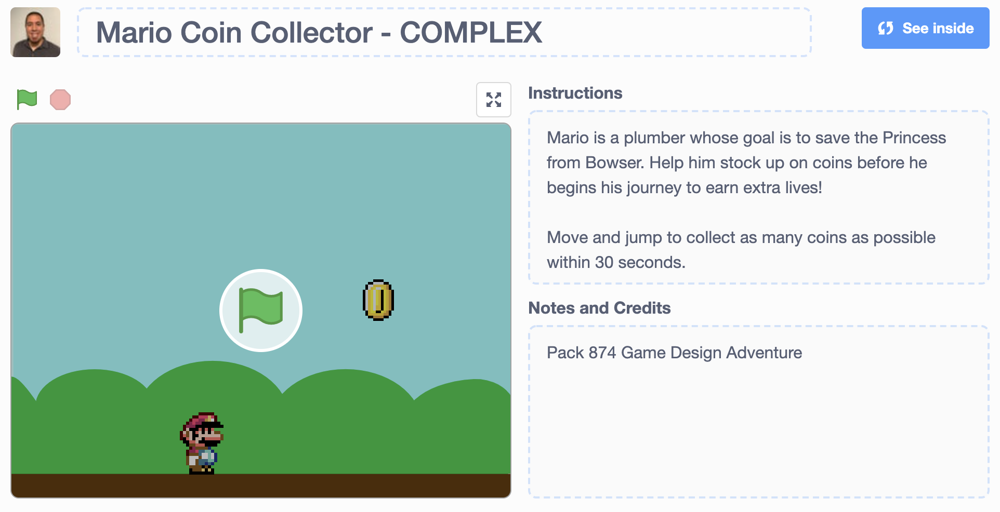

# Cub Scouts Game Design
Sample files for a simple mario coin collector game built in Scratch. Designed for the Game Design adventure for Webelos/AoL scouts.

Scouts must complete the following four requirements:

1. Decide on the elements for a game (story, goals/mechanics, aesthetics, medium/technology)
2. List five internet safety rules put into practice while using the internet on your computer or smartphone
3. Create your game (e.g. video game, board game, card game)
4. Teach an adult or another Scout how to play the game

During the course of their meeting, scouts will be asked to follow along in the Scratch platform, starting with a blank template and working towards a simple game where Mario must collect as many coins as possible within a 30 second time limit. Scratch programming will be used to control player movement, animations, sound effects, and game logic (e.g. score, countdown timer).

## DEMO

