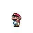

# Cub Scouts Game Design
Sample files for a simple mario coin collector game built in Scratch. Designed for the Game Design adventure for Webelos/AoL scouts.

Scouts must complete the following four requirements:

1. Decide on the elements for a game (story, goals/mechanics, aesthetics, medium/technology)
2. List five internet safety rules put into practice while using the internet on your computer or smartphone
3. Create your game (e.g. video game, board game, card game)
4. Teach an adult or another Scout how to play the game

During the course of their meeting, scouts will be asked to follow along in the Scratch platform, starting with a blank template and working towards a simple game where Mario must collect as many coins as possible within a 30 second time limit. Scratch programming will be used to control player movement, animations, sound effects, and game logic (e.g. score, countdown timer).

## FILES

[Blank Template](https://scratch.mit.edu/projects/629363499/)
Scouts will start with this file, which includes a pre-chosen background and some sprites for mario and coin. 

[Simple Version](https://scratch.mit.edu/projects/629360870/)
This is roughly what the scouts will be building in 45 minutes. Code will control basic player movement, spawning new coins, and game logic such as score and timer.

[Complex Version](https://scratch.mit.edu/projects/629351954/)
This is a slightly more complex version with added animations for mario and dynamic text (READY, GO, GAMER OVER) on the screen. I'll be sure to provide this version if the scouts want to see how it's done and incorporate it into their project.

## Demo

## Sprites Included:
Sprites are courtesy of [The Spriters Resource](https://www.spriters-resource.com/) and may not be repurposed for commercial games. 

### Mario 
From: [SNES - Super Mario World - Mario](https://www.spriters-resource.com/snes/smarioworld/sheet/53664/)

### Coin
From: [SNES - Super Mario World - Animated Foreground Tiles](https://www.spriters-resource.com/snes/smarioworld/sheet/144428/)
